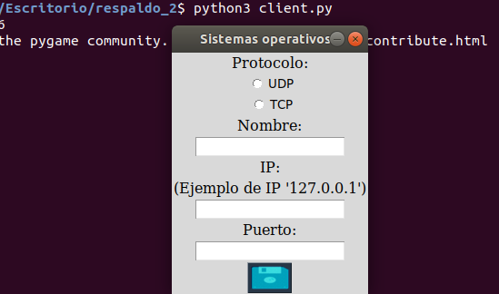

# Sockets-UDP-TCP
## Chat Local

Lenguaje: Python3

En el presente proyecto, se realizo un socket con servidor el cual contiene interfaz grafica y maneja tanto protocolos UDP como TCP, redirigiendo el puerto al protocolo correspondiente.

